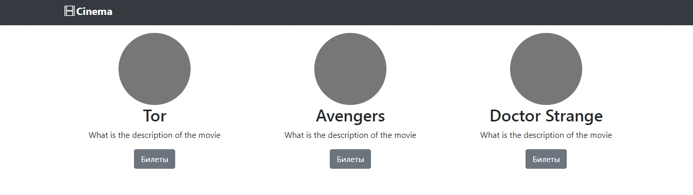
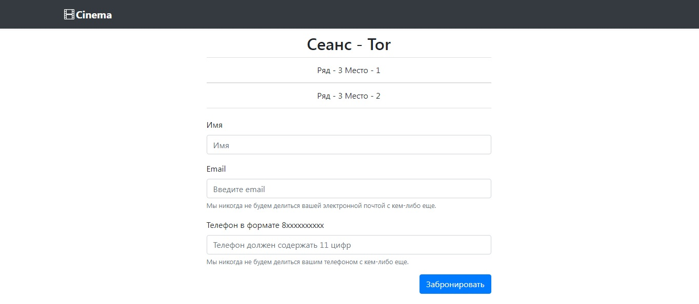

#### Описание:
Сайт для бронирования билетов в кино. Выбор сеансов, выбор мест с последующим 
бронированием через введение персональных данных. Защищен от одновременного 
бронирования билетов из разных сессий.

#### Используемые технологии:
- Spring Boot
- Spring MVC
- Spring Data JPA
- PostgreSQL
- Liquibase
- CheckStyle  
- Thymeleaf
- HTML

